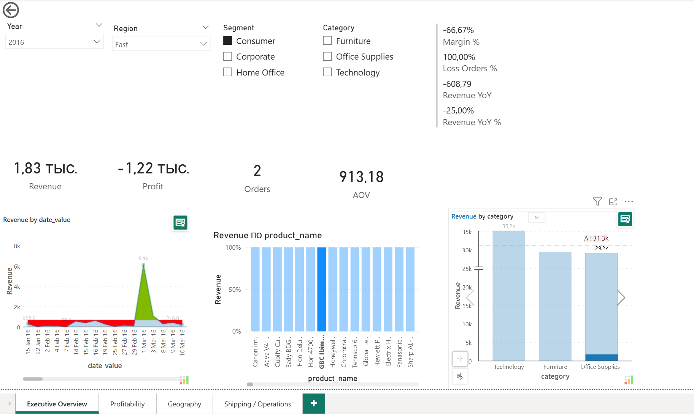
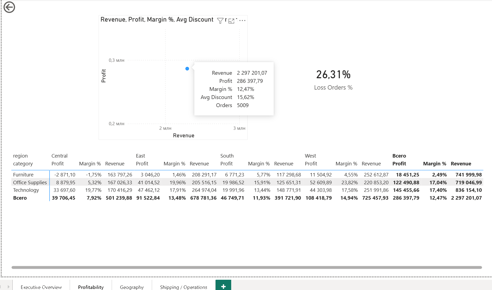
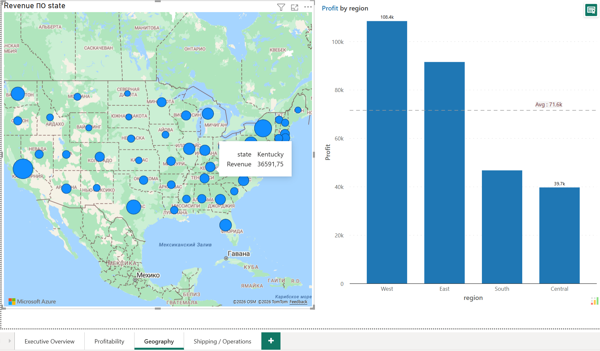
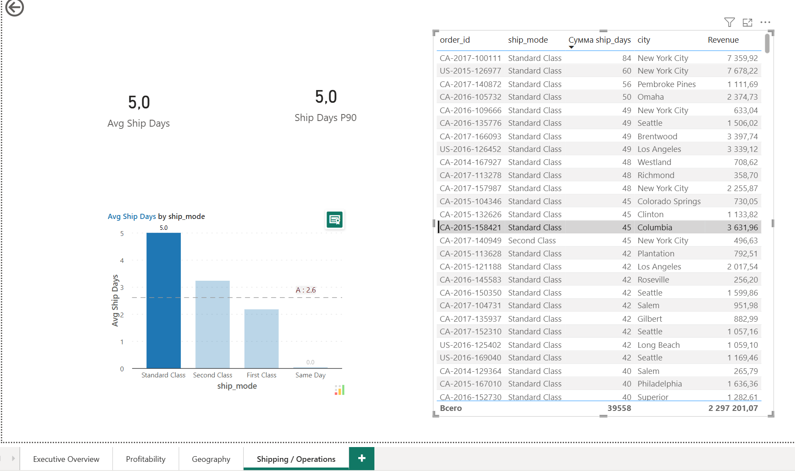
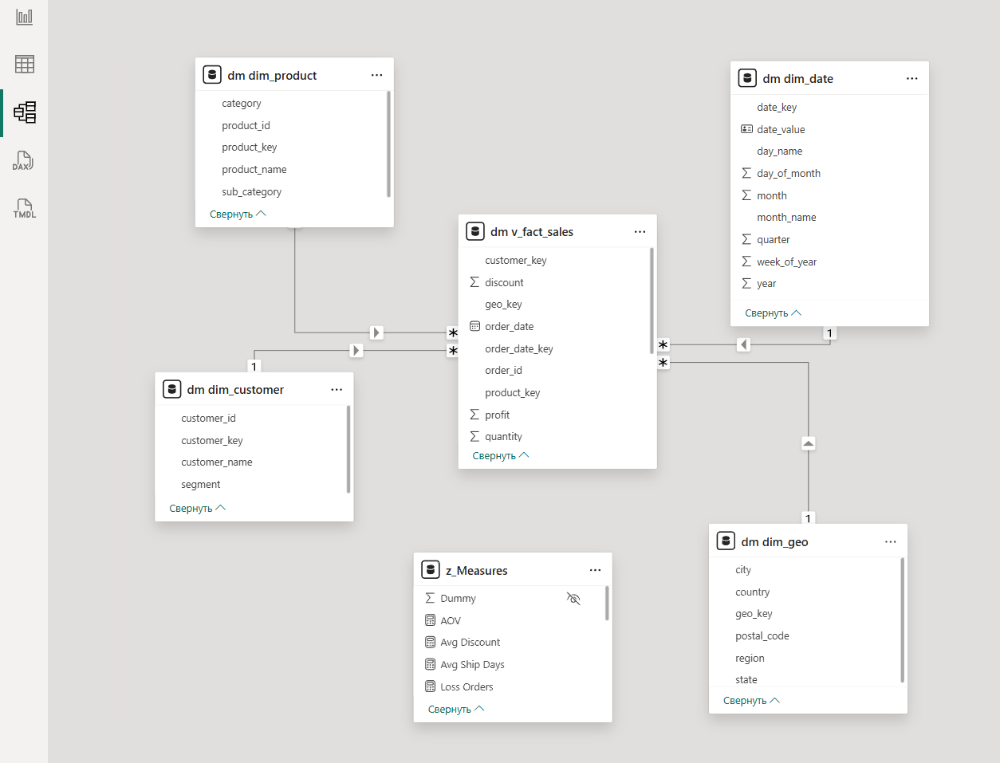

# Superstore Sales Dashboard (Power BI + PostgreSQL)

End-to-end BI-проект на классическом датасете Superstore: **загрузка CSV → очистка и стандартизация → витрина (Data Mart) по модели “звезда” → Power BI отчёт** с KPI, трендами, географией, прибыльностью и операционными метриками доставки.

---

## Что реализовано

Берём “сырой” файл заказов (CSV), приводим данные к корректному виду (даты, числа, пропуски), строим витрину данных в PostgreSQL (удобную для аналитики и Power BI), добавляем проверки качества и оптимизацию скорости, а затем собираем интерактивный отчёт для ответа на вопросы бизнеса:

- Как меняется **выручка/прибыль** со временем?
- Какие **категории/товары** дают больше всего выручки и прибыли?
- Где (по штатам/регионам) продажи сильнее/слабее?
- Какие **режимы доставки** “тормозят”, и где возможны улучшения?
- Есть ли **проблемы качества данных** (аномальные скидки, некорректные даты и т.п.)?

---

## Функциональность

### Data Engineering / DWH
- **Слои данных:** `raw → stg → dm`
  - `raw` — “как есть” из CSV
  - `stg` — очистка/типизация/нормализация
  - `dm` — витрина для аналитики (звезда)
- **Модель “звезда”:**
  - `dm_v_fact_sales` — факт продаж
  - `dm_dim_date`, `dm_dim_product`, `dm_dim_customer`, `dm_dim_geo` — измерения
- **Материализованные витрины (materialized views)** для быстрых запросов и Power BI
- **Индексы** на ключевые поля и часто используемые разрезы

### Data Quality
- Набор базовых проверок качества (валидаторы):
  - пропуски (NULL) в ключевых полях
  - диапазоны скидок
  - ship_date ≥ order_date
  - “аномальные” значения (например, слишком большие ship_days)

### Power BI
- 4 страницы отчёта:
  - **Executive Overview** — KPI и обзор
  - **Profitability** — прибыльность по категориям/регионам + scatter (Revenue vs Profit)
  - **Geography** — карта и прибыль по регионам
  - **Shipping / Operations** — метрики доставки + “длинные” доставки (P90)
- Единый набор мер (DAX) в таблице `z_Measures`:
  - Revenue, Profit, Orders, Quantity, AOV, Margin %, Avg Discount
  - Revenue YTD / Profit YTD
  - Revenue YoY / Revenue YoY %
  - Avg Ship Days, Ship Days P90
  - Loss Orders / Loss Orders %

---

## Архитектура (raw → staging → dm)

**1) Raw слой**
- Загружаем CSV в `raw.superstore_orders` без “умных” преобразований.

**2) Staging слой**
- Приведение типов: даты, числовые поля (sales, profit, discount)
- Базовая очистка
- Обогащение: `ship_days` (Ship Date - Order Date)
- Техническое поле `load_dts`

**3) Data Mart слой**
- Измерения (dimension tables)
- Факт продаж (fact)
- Представление/вью для Power BI (удобные поля и ключи)
- Материализованные вьюхи (агрегации) + индексы

---

## Технологии
- **PostgreSQL** (DWH, витрины, индексы, materialized views)
- **Docker + docker-compose** (локальный “мини-прод” разворот БД)
- **SQL** (ETL логика, витрина)
- **Power BI Desktop** (модель, визуализации, DAX меры)

---

## Поднять PostgreSQL в Docker

docker-compose up -d
docker ps

##  Скриншоты

### Executive Overview

### Profitability (scatter + матрица)

### Geography (map + profit by region)

### Shipping / Operations

### Data model (Star Schema)

---

## Скачать отчет
- **PBIX (Power BI Desktop):** [superstore_dashboard.pbix](powerbi/superstore_dashboard.pbix)
- **PDF (preview):** [superstore_dashboard.pdf](powerbi/superstore_dashboard.pdf)